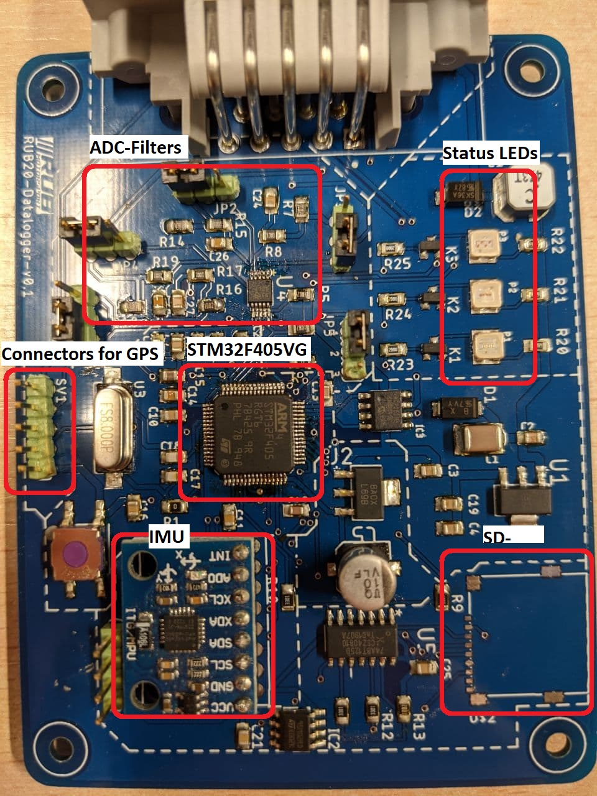
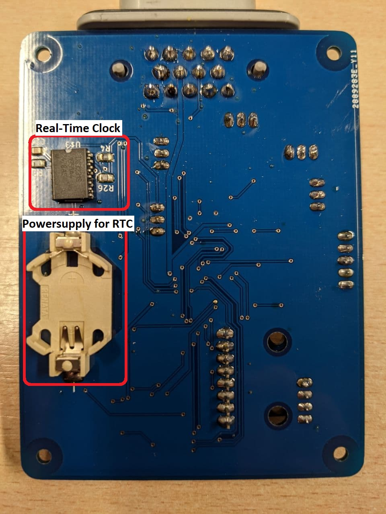

# Datalogger-RubMotorsport

## Overview

For all RUB-Motorsport vehicles it makes sense to install a data logger in the vehicle. This can access and log all engine data (from the MS3) and all sensor data via the CAN bus. Up to now, RUBMotorsport has used a purchased data logger from 2D. This works well and has worked reliably over the years. However, only one data logger is available, due to the very high purchase price and the relatively easy installation in new vehicles, a new purchase was not made. The big disadvantage of this data logger is the software that comes with it. This must be used to export data from the data logger in e.g. *.csv files. The software license must be renewed every year, at the latest in February for one year. For the renewal of the license there is an annual fee of 500€. Due to the reasons mentioned above, in the 2020 season we will develop our own data logger based on a STM32F405RG. This should have all the previous functions of the 2D data logger and at a later date can also be integrated into the planned telemetry concept. 

The data logger has several connections to the outside world. These include the power supply of 12V, the connection to a GPS antenna, the possibility to process four sensor analog signals and supply them with voltage and the measurement of acceleration using an IMU. The option to store the measurement data on a microSD card is also part of the peripherals.

	

	

